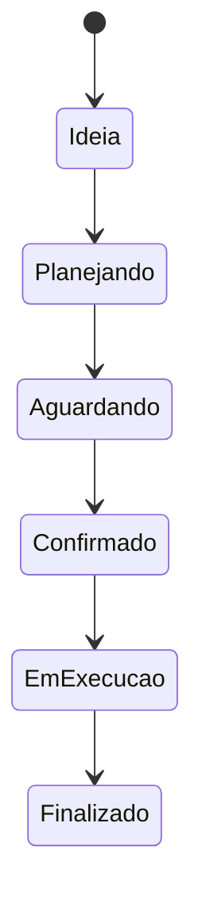

# Plataforma de Gestão de Eventos

> Estudo de caso público de uma aplicação para planejamento e operação de eventos. O código-fonte completo permanece privado.

## Visão geral

Sistema web e PWA que reúne agenda, Kanban, fornecedores, atrações, documentos, cronograma e contratos para acompanhar o evento desde a ideia até a finalização.

## Problema resolvido

Organizadores precisam controlar várias pessoas, prazos, documentos e dependências ao mesmo tempo. A plataforma centraliza essas informações e deixa o andamento visível para todos os perfis autorizados.

## Funcionalidades

- calendário dinâmico de eventos;
- quadro Kanban com avanço por status;
- cadastro de bandas, integrantes e documentos;
- gestão de prestadores, fornecedores e equipamentos;
- cronograma, intervalos e eventos paralelos;
- reservas de mesas e inscrições por QR Code;
- controle de divulgação;
- contratos e identificadores por evento;
- perfil de leitura para acompanhamento.

## Fluxo operacional

## Tecnologias

`Next.js 16` · `React 19` · `TypeScript` · `Tailwind CSS` · `Supabase` · `Serwist` · `dnd-kit` · `Radix UI`

## Decisões de arquitetura

- App Router e componentes reutilizáveis;
- autenticação e dados persistentes com Supabase;
- PWA para consulta e atualização em campo;
- separação entre eventos, pessoas, documentos e contratos;
- interface orientada a calendário e fluxo de trabalho.

## Status

Em desenvolvimento. A apresentação pública demonstra o escopo e as decisões técnicas sem divulgar documentos, dados pessoais ou contratos reais.

## Autor

Desenvolvido por [Amauri Daliessi Junior](https://github.com/JrDaliessi).
